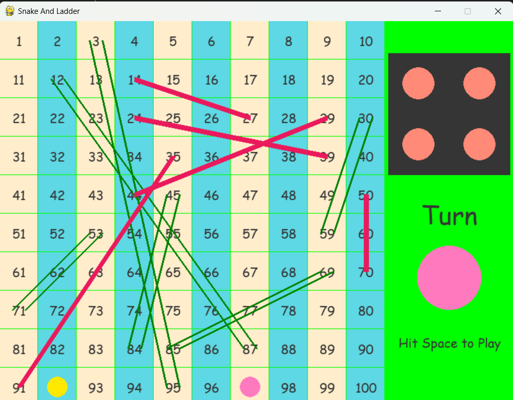

# snakes_and_ladders
Welcome to the Snake and Ladder game, a classic board game implemented using Python and Pygame. This project brings the fun and excitement of the traditional game to your computer screen.



# Features
- **Interactive Gameplay**: Play the classic Snake and Ladder game with two players.
- **Dynamic Board**: The board is dynamically generated with random snakes and ladders.
- **Smooth Animations**: Enjoy smooth transitions and animations for dice rolls and player movements.
- **End Game Screen**: The game displays a "Game Over" screen with the winner when a player reaches the end.

## Installation

To play the game, you need to have Python and Pygame installed on your system. You can install Pygame using pip:

```sh
pip install pygame
